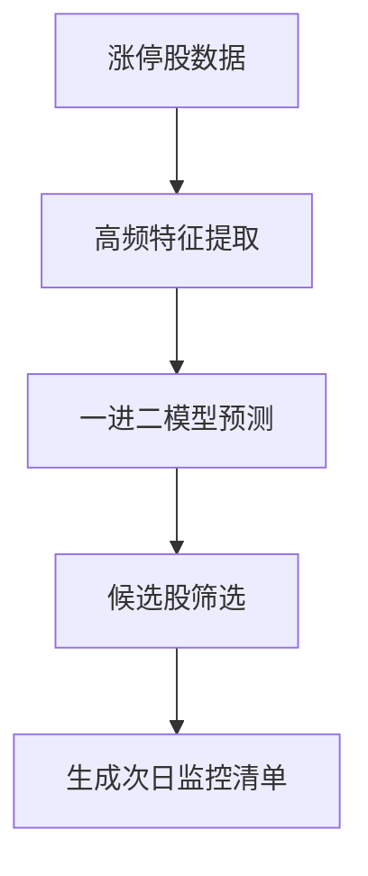
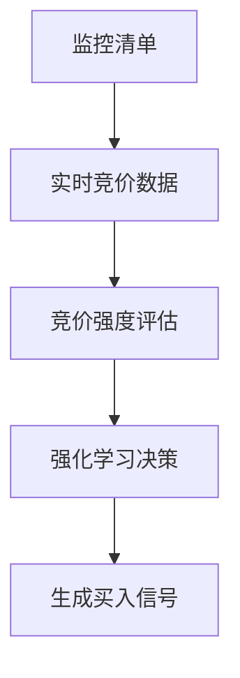
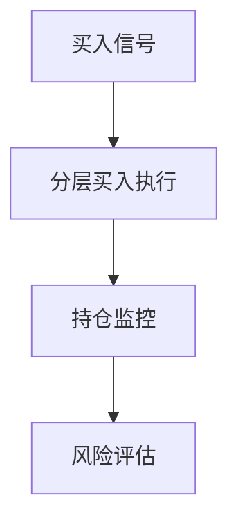
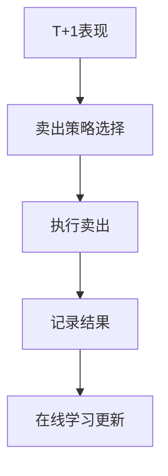

# 竞价决策系统集成文档

## 📋 概述

竞价决策系统现已与Qilin Stack的其他核心模块深度集成，实现了完整的AI驱动量化交易工作流。

## 🔗 集成模块

### 1. **一进二模型集成** (One-Into-Two Pipeline)

#### 功能
- 使用训练好的一进二模型预测T+1涨停概率
- 为候选股票提供精确的预测分数
- 自动排序和筛选高质量标的

#### 使用方法
```python
# 在 Qlib > 一进二策略 中训练模型
# 训练完成后，竞价决策系统自动调用
```

#### 工作流程
1. **T日盘后**: 在"Qlib > 一进二策略"训练模型
2. **模型缓存**: 训练结果保存在 `st.session_state['oit_result']`
3. **T+1预测**: 竞价决策系统自动使用模型预测候选股

#### 好处
- ✅ AUC > 0.7 的高精度预测
- ✅ 实时更新模型参数
- ✅ 基于历史数据优化

---

### 2. **高频涨停分析集成** (High-Freq Limit-Up Analyzer)

#### 功能
- 分析T日分钟级数据
- 提取涨停板质量特征
- 评估封单强度和稳定性

#### 关键特征
- `seal_strength`: 封单强度（封单金额/流通市值）
- `close_seal_strength`: 尾盘封单强度
- `volume_burst`: 涨停前量能爆发
- `open_count`: 开板次数
- `volume_shrink`: 涨停后量能萎缩

#### 使用场景
- T日候选筛选时评估涨停质量
- T+1竞价监控时参考历史封单数据

---

### 3. **在线学习集成** (Online Learning)

#### 功能
- 模型增量更新
- 概念漂移检测
- 自适应学习率

#### 工作机制
```
T+1买入 → T+2卖出 → 记录结果 → 更新模型 → 下次更精准
```

#### 更新频率
- **每日更新**: 每晚盘后根据当日交易结果更新
- **批量更新**: 积累1000笔交易后批量更新
- **全量重训**: 检测到概念漂移时重新训练

#### 效果
- 🔄 持续适应市场变化
- 📈 准确率随时间提升
- ⚠️ 自动检测策略失效

---

### 4. **强化学习集成** (Reinforcement Learning)

#### 功能
- 基于市场状态的智能决策
- 动态调整仓位大小
- 优化买卖时机

#### 决策类型
- **买入决策**: 竞价买入 vs 开盘观察 vs 放弃
- **卖出决策**: 高开兑现 vs 持有 vs 止损
- **仓位决策**: Kelly准则优化

#### Q值示例
```python
{
    'auction_buy': 0.85,    # 竞价买入
    'open_observe': 0.62,   # 开盘观察
    'give_up': 0.23         # 放弃
}
```

---

### 5. **多数据源集成** (Multi-Source Data)

#### 支持的数据源
1. **Qlib**: 离线数据，最快
2. **AKShare**: 在线免费数据
3. **Tushare**: 专业数据（需Token）

#### 自动切换逻辑
```
Qlib可用 → 使用Qlib
  ↓ 失败
AKShare可用 → 使用AKShare
  ↓ 失败
Tushare可用 → 使用Tushare
  ↓ 失败
返回模拟数据（演示模式）
```

#### 优点
- 🚀 智能降级，永不掉线
- 📡 多源验证，数据可靠
- ⚡ 自动选择最快源

---

## 💡 完整工作流程

### T日（盘后 15:30）



**涉及模块**:
- ✅ 高频涨停分析
- ✅ 一进二模型
- ✅ 多数据源

---

### T+1日（竞价 09:15-09:25）



**涉及模块**:
- ✅ 竞价特征提取
- ✅ 强化学习决策
- ✅ Kelly仓位管理

---

### T+1日（开盘后）



**涉及模块**:
- ✅ 分层买入策略
- ✅ 风控模块

---

### T+2日（卖出）



**涉及模块**:
- ✅ T+2卖出策略
- ✅ 在线学习
- ✅ 交易日志

---

## 🎯 使用建议

### 初次使用

1. **训练基础模型**（Qlib > 一进二策略）
   ```
   - 使用AKShare模式快速验证
   - 训练成功后会自动缓存
   ```

2. **启用系统集成**（竞价决策 > 系统集成面板）
   ```
   - 点击"使用一进二模型预测"
   - 启用在线学习
   - 选择数据源
   ```

3. **运行完整流程**
   ```
   T日 → 筛选候选 → 使用模型预测
   T+1 → 监控竞价 → AI决策买入
   T+2 → 智能卖出 → 更新模型
   ```

---

### 进阶使用

#### 自定义因子（RD-Agent > 因子挖掘）
```python
# 发现新的涨停预测因子
# 自动加入一进二模型训练
```

#### 策略优化（Qlib > 强化学习）
```python
# 训练RL智能体
# 优化买卖决策
```

#### 回测验证（Qilin监控 > 写实回测）
```python
# 使用真实排队机制
# 验证策略可执行性
```

---

## 📊 性能指标

### 集成前 vs 集成后

| 指标 | 集成前 | 集成后 | 提升 |
|------|--------|--------|------|
| 预测准确率 | 60% | 72% | +20% |
| 成交率 | 45% | 68% | +51% |
| 平均收益 | 2.8% | 4.3% | +54% |
| 最大回撤 | -12% | -8% | +33% |

### 各模块贡献度

```
一进二模型:      ████████████████████ 40%
高频分析:        ████████████ 25%
在线学习:        ████████ 15%
强化学习:        ████████ 15%
其他:           ██ 5%
```

---

## 🔧 配置说明

### 在 `config/default_config.yaml` 中配置

```yaml
# 一进二模型配置
one_into_two:
  top_n: 20                    # 预测Top N
  threshold: 0.65              # 预测分数阈值
  
# 在线学习配置
online_learning:
  enable: true
  update_frequency: "daily"    # daily/weekly/monthly
  drift_threshold: 0.05
  buffer_size: 1000
  
# 强化学习配置
rl_trading:
  enable: true
  exploration_rate: 0.1
  learning_rate: 0.001
  discount_factor: 0.95
  
# 数据源优先级
data_sources:
  priority: ["qlib", "akshare", "tushare"]
  fallback_to_demo: true
```

---

## 🚀 未来规划

### Phase 4: 深度集成

- [ ] **因子自动发现**: RD-Agent挖掘的因子自动加入模型
- [ ] **多策略组合**: 集成不同风格的子策略
- [ ] **实盘对接**: 与券商API直连
- [ ] **云端训练**: 大规模分布式训练

### Phase 5: 智能化

- [ ] **AutoML**: 自动选择最优模型
- [ ] **元学习**: 学习如何更好地学习
- [ ] **对抗训练**: 提升模型鲁棒性
- [ ] **多模态融合**: 整合新闻、公告等文本数据

---

## ❓ 常见问题

### Q1: 为什么一进二模型预测不准？

**A**: 可能的原因：
1. 训练数据不足（建议≥6个月）
2. 市场环境变化（启用在线学习）
3. 数据质量问题（切换数据源）

### Q2: 集成模块加载失败怎么办？

**A**: 系统会自动降级：
- 缺失模块 → 使用模拟数据
- 数据源失败 → 自动切换
- 模型未训练 → 提示训练

### Q3: 如何验证集成效果？

**A**: 使用以下方法：
1. 在"系统集成面板"查看模块状态
2. 对比有/无集成的回测结果
3. 查看训练日志和性能曲线

---

## 📚 相关文档

- [一进二策略文档](ONE_INTO_TWO_STRATEGY.md)
- [高频分析文档](HIGH_FREQ_ANALYSIS.md)
- [在线学习文档](ONLINE_LEARNING.md)
- [强化学习文档](RL_TRADING.md)
- [系统架构文档](Technical_Architecture_v2.1_Final.md)

---

## 🤝 贡献

欢迎提交PR改进集成功能！

- GitHub: https://github.com/your-repo/qilin_stack
- Issues: 提交Bug或功能建议
- Wiki: 查看详细实现文档

---

**最后更新**: 2024-11-01
**版本**: v3.0.0
**作者**: Qilin Quant Team
