# 竞价决策系统完整工作流程框架

## 📋 概述

本文档详细描述了竞价决策系统从数据准备到交易执行的**完整端到端工作流程**，涵盖Qlib、RD-Agent、竞价决策等所有模块的协同工作机制。

---

## 🏗️ 系统架构总览

```
┌─────────────────────────────────────────────────────────────────┐
│                    Qilin Stack 竞价决策系统                        │
│                        End-to-End Workflow                       │
└─────────────────────────────────────────────────────────────────┘

📊 数据层          🧪 研究层          🎯 决策层          💰 执行层
   │                │                │                │
   ├─ Qlib数据      ├─ 因子挖掘      ├─ T日筛选       ├─ T+1买入
   ├─ AKShare      ├─ 特征工程      ├─ T+1竞价       ├─ T+2卖出
   ├─ Tushare      ├─ 模型训练      ├─ 风险评估      └─ 绩效分析
   └─ 高频数据      └─ 模型进化      └─ 仓位管理
```

---

## 🔄 Phase 1: 数据准备与因子研发

### 1.1 数据获取与存储

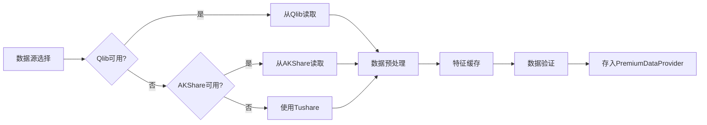

**模块位置**:
- `data_layer/premium_data_provider.py` - 统一数据接口
- `qlib_enhanced/multi_source_data.py` - 多数据源管理
- `cache/feature_cache.py` - 特征缓存

**执行时机**: 
- **每日盘后** 15:30-16:00
- **数据更新**: 自动增量更新

**配置项**:
```yaml
data_sources:
  priority: ["qlib", "akshare", "tushare"]
  cache_dir: "./data/cache"
  update_mode: "incremental"
```

---

### 1.2 因子挖掘（RD-Agent）

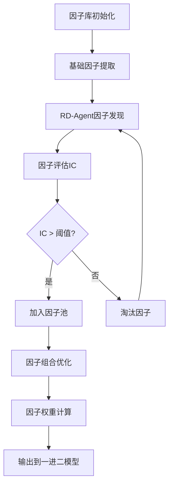

**模块位置**:
- `rd_agent/factor_discovery_simple.py` - 简化版因子发现
- `rd_agent/llm_factor_discovery.py` - LLM驱动因子生成
- `factors/limitup_advanced_factors.py` - 高级因子库
- `app/factor_optimizer.py` - 因子优化器

**15个预定义核心因子**:

| ID | 因子名称 | 表达式 | 预期IC | 类别 |
|----|----------|--------|--------|------|
| limitup_001 | 封板强度 | 封单金额/流通市值 | 0.08 | 封板类 |
| limitup_002 | 连板高度 | log(连板+1)*量比 | 0.12 | 连板类 |
| limitup_003 | 题材共振 | 同题材数*个股强度 | 0.10 | 题材类 |
| limitup_004 | 早盘涨停 | 1-涨停分钟/240 | 0.15 | 时机类 |
| limitup_005 | 量能爆发 | 成交量/20日均量 | 0.09 | 量能类 |
| limitup_006 | 大单净流入 | (大买-大卖)/成交额 | 0.11 | 资金类 |
| limitup_007 | 封单持续性 | 封单持续分钟/240 | 0.07 | 封板类 |
| limitup_008 | 开板惩罚 | exp(-开板次数) | -0.06 | 封板类 |
| limitup_009 | 换手率适中 | 1-\|换手-最优\|/最优 | 0.08 | 量能类 |
| limitup_010 | 首板优势 | is_first*(1+题材) | 0.14 | 连板类 |
| limitup_011 | 尾盘封板 | 尾盘金额/平均金额 | 0.09 | 封板类 |
| limitup_012 | 均价偏离 | (收盘-VWAP)/VWAP | 0.06 | 技术类 |
| limitup_013 | 前高距离 | (前高-当前)/前高 | 0.05 | 技术类 |
| limitup_014 | 板块联动 | 板块率*资金流入 | 0.13 | 题材类 |
| limitup_015 | 竞价强度 | 竞价量/流通市值 | 0.10 | 时机类 |

**执行时机**:
- **周期性**: 每周日执行因子挖掘
- **触发式**: 策略性能下降时触发
- **手动式**: 研究人员主动发起

---

### 1.3 特征工程

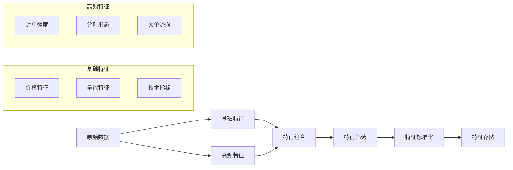

**模块位置**:
- `features/auction_features.py` - 竞价特征提取
- `features/one_into_two_feature_builder.py` - 一进二特征构建
- `qlib_enhanced/high_freq_limitup.py` - 高频涨停分析

**特征类型** (100+维度):

1. **T日封板特征** (20维)
   - 封板强度、封板时间、开板次数
   - 封单金额、封单持续时间
   - 尾盘封单强度、封板质量评分

2. **历史竞价特征** (15维)
   - 过去N天平均竞价涨幅
   - 竞价波动率、竞价一致性
   - 高开/低开频率

3. **市场环境特征** (10维)
   - 市场涨停数、市场情绪
   - 板块涨停数、板块强度

4. **连续性特征** (15维)
   - 连续上涨天数、连板高度
   - 趋势强度、动量指标

5. **高频微观特征** (40维)
   - 分钟级量能爆发
   - 大单流入节奏
   - 封单稳定性、成交萎缩度

---

## 🎓 Phase 2: 模型训练与进化

### 2.1 一进二模型训练流程

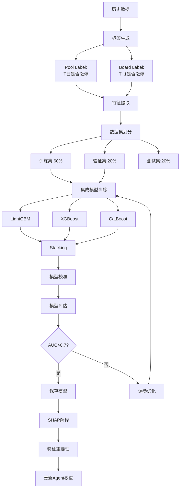

**模块位置**:
- `qlib_enhanced/one_into_two_pipeline.py` - 一进二训练管道
- `scripts/pipeline_limitup_research.py` - 研究训练脚本
- `training/advanced_trainers.py` - 高级训练器
- `ml/model_explainer.py` - 模型解释器

**训练配置**:
```python
OneIntoTwoTrainer(
    top_n=20,                    # Top N预测
    lookback_days=5,             # 历史回溯天数
    min_samples=1000,            # 最小样本数
    cv_folds=5,                  # 交叉验证折数
    early_stopping_rounds=50     # 早停轮数
)
```

**模型性能指标**:
- **AUC**: >0.70 合格, >0.75 优秀, >0.80 卓越
- **P@20**: Precision at Top 20, 目标>30%
- **Hit@20**: Hit Rate at Top 20, 目标>25%

---

### 2.2 模型进化与优化

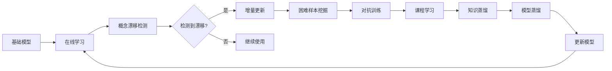

**模块位置**:
- `qlib_enhanced/online_learning.py` - 在线学习管理
- `training/hard_case_mining.py` - 困难样本挖掘
- `training/adversarial_trainer.py` - 对抗训练
- `monitoring/drift_detector.py` - 漂移检测

**进化策略**:

1. **在线学习** (每日)
   - 增量更新：每晚根据当日结果更新
   - 缓冲机制：积累1000笔后批量更新
   - 漂移检测：自动检测市场变化

2. **困难样本挖掘** (每周)
   - 识别预测错误案例
   - 生成对抗样本
   - 重点强化训练

3. **课程学习** (每月)
   - 从简单到复杂渐进训练
   - 动态调整样本权重
   - 确保稳定收敛

4. **知识蒸馏** (每季度)
   - 大模型→小模型知识迁移
   - 保持性能提升推理速度
   - 便于实盘部署

---

## 🎯 Phase 3: T日决策与筛选

### 3.1 T日盘后完整流程 (15:30-16:00)

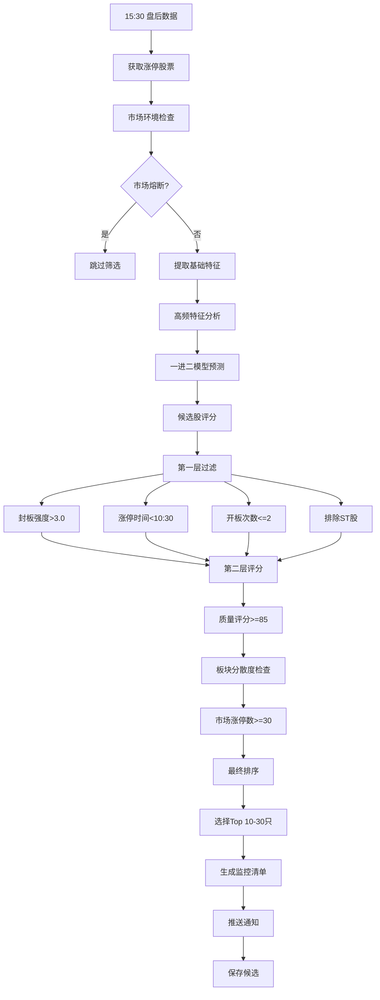

**决策引擎**:
- `app/auction_decision_engine.py` - 核心决策引擎
- `workflow/trading_workflow.py` - 工作流编排

**筛选标准**:

| 层级 | 条件 | 说明 | 淘汰率 |
|------|------|------|--------|
| **基础过滤** | 封板强度>3.0 | 封单金额/流通市值 | 30% |
| | 涨停时间<10:30 | 越早越好 | 20% |
| | 开板次数<=2 | 避免烂板 | 15% |
| | 排除ST股 | 风险控制 | 5% |
| **质量评分** | 评分>=85分 | 综合质量 | 20% |
| | 板块分散度 | HHI<0.5 | 5% |
| **市场环境** | 涨停数>=30只 | 市场情绪 | 5% |

**输出**:
```json
{
  "date": "2024-11-01",
  "candidates": [
    {
      "symbol": "000001.SZ",
      "name": "平安银行",
      "seal_strength": 5.2,
      "limitup_time": "09:45",
      "open_count": 0,
      "quality_score": 92.5,
      "prediction_score": 0.85,
      "recommended_action": "竞价买入"
    }
  ],
  "total_candidates": 23,
  "market_limitup_count": 156,
  "market_sentiment": "活跃"
}
```

---

### 3.2 竞价特征提取

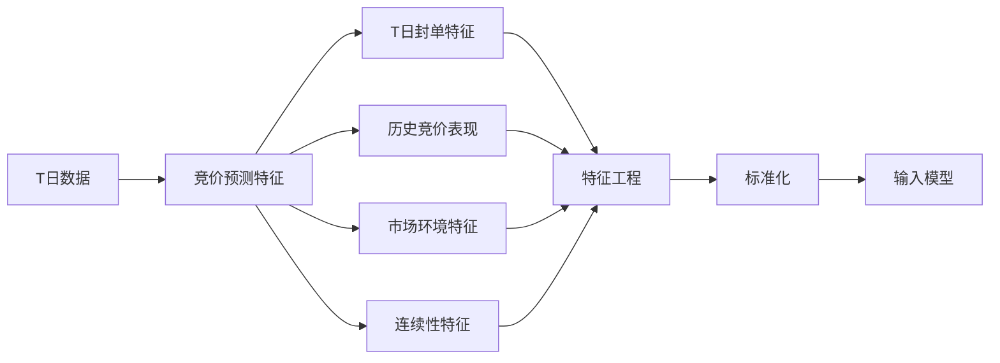

**模块**: `features/auction_features.py`

---

## 💹 Phase 4: T+1竞价监控与买入

### 4.1 T+1日竞价完整流程 (09:15-09:30)

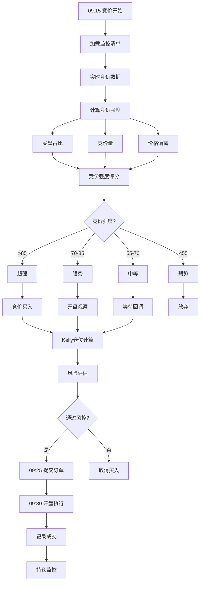

**关键时间点**:
- **09:15**: 开始监控竞价数据
- **09:20**: 中期评估，调整策略
- **09:24**: 最终决策
- **09:25**: 提交竞价订单
- **09:30**: 开盘执行/观察

**竞价强度计算**:
```python
竞价强度 = (
    买盘占比 * 0.35 +           # 买卖力量对比
    竞价量/流通市值 * 0.25 +     # 参与度
    价格强度 * 0.20 +           # 价格位置
    封单预期 * 0.20             # 历史表现
) * 100
```

---

### 4.2 分层买入策略

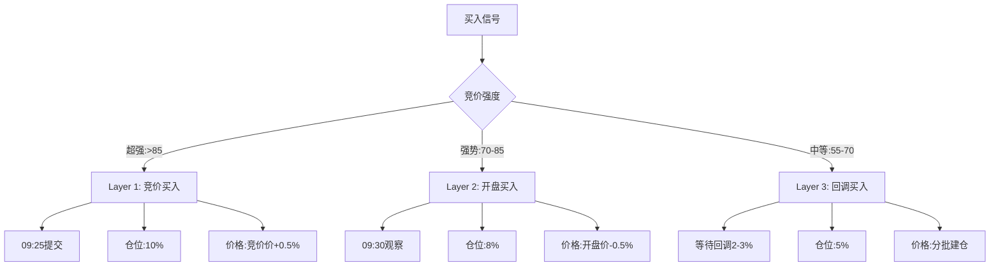

**模块**: `strategies/tiered_buy_strategy.py`

**分层参数**:

| 层级 | 竞价强度 | 买入时机 | 仓位比例 | 价格策略 |
|------|----------|----------|----------|----------|
| Layer 1 | >85 超强 | 竞价买入 | 10% | 竞价价+0.5% |
| Layer 2 | 70-85 强势 | 开盘买入 | 8% | 开盘价-0.5% |
| Layer 3 | 55-70 中等 | 回调买入 | 5% | 分批-2~3% |

---

### 4.3 Kelly仓位管理

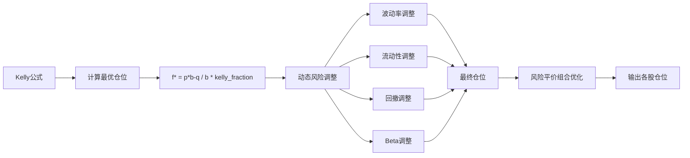

**模块**: `risk/kelly_position_manager.py`

**Kelly公式**:
```python
f* = (p * b - q) / b * kelly_fraction

其中:
f* = 最优仓位比例
p = 胜率 (历史统计)
b = 赔率 (平均盈利/平均亏损)
q = 1 - p (败率)
kelly_fraction = 0.25 (保守系数)
```

**动态调整**:
```python
adjusted_position = base_position * (
    target_volatility / actual_volatility *      # 波动率调整
    liquidity_score *                            # 流动性调整
    min(1.0, max_drawdown_limit / current_dd) *  # 回撤调整
    1.0 / max(0.5, min(1.5, beta))              # Beta调整
)
```

---

## 📊 Phase 5: 持仓监控与风控

### 5.1 T+1盘中监控 (09:30-15:00)

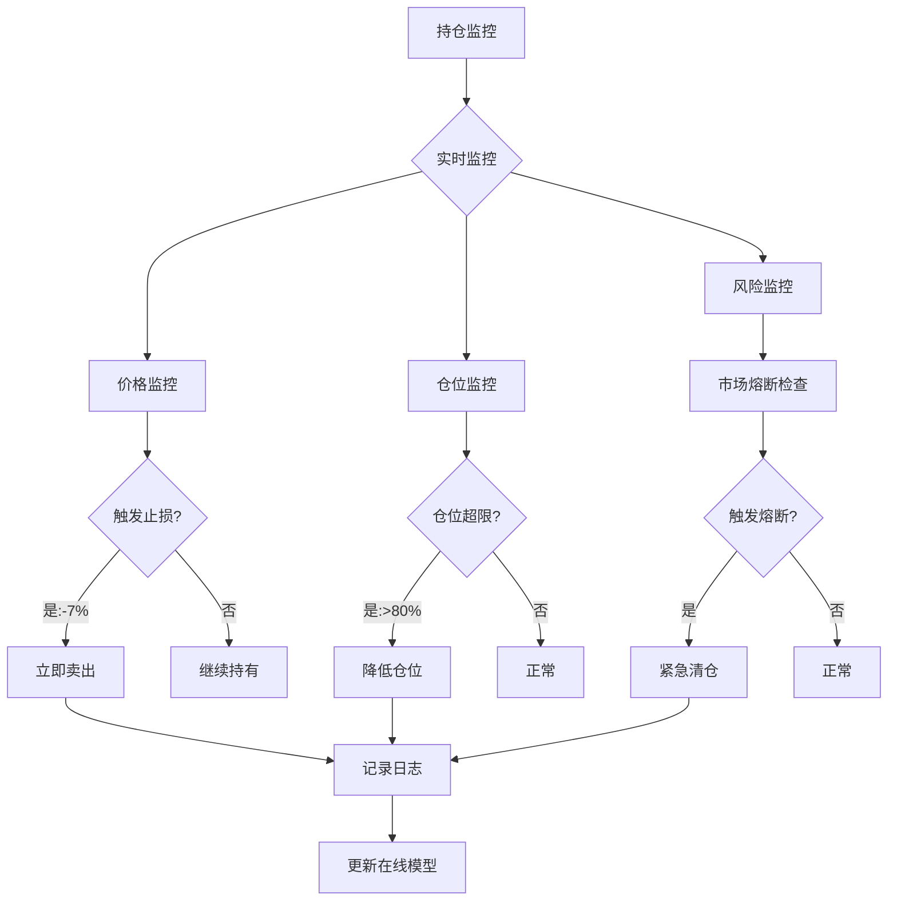

**风控层级**:

1. **个股风控**
   - 止损线：-7%
   - 止盈线：+15%
   - 单票仓位上限：10%

2. **组合风控**
   - 总仓位上限：80%
   - 最大持仓数：10只
   - HHI分散度：<0.2

3. **市场风控** (MarketCircuitBreaker)
   - 指数下跌>2%：降仓30%
   - 跌停数>30：降仓50%
   - 连续亏损3天：暂停交易

**模块**:
- `risk/market_circuit_breaker.py` - 市场熔断
- `backtest/extreme_market_handler.py` - 极端行情处理

---

### 5.2 极端行情5级保护

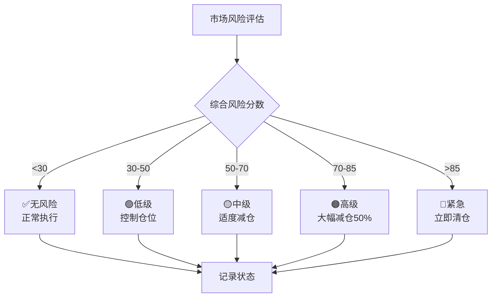

**风险评估维度**:
- 流动性风险 (0-100)
- 极端事件风险 (0-100)
- 系统性风险 (0-100)

---

## 💰 Phase 6: T+2卖出执行

### 6.1 T+2日卖出完整流程 (09:25-09:35)

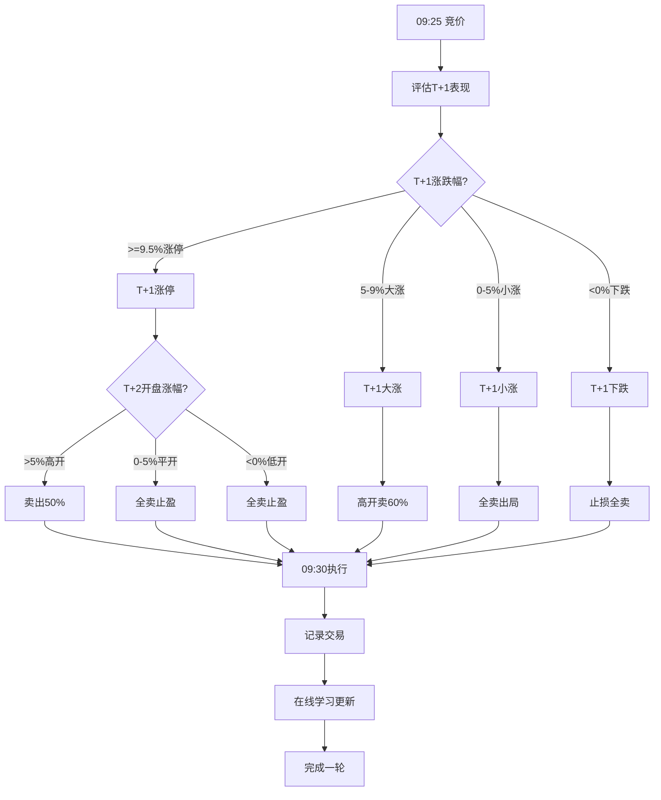

**卖出策略矩阵**:

| T+1表现 | T+2开盘 | 卖出比例 | 策略逻辑 |
|---------|---------|----------|----------|
| 涨停(≥9.5%) | 高开>5% | 50% | 高开兑现一半 |
| 涨停(≥9.5%) | 平开0-5% | 100% | 全卖止盈 |
| 涨停(≥9.5%) | 低开<0% | 100% | 全卖止盈 |
| 大涨(5-9%) | 高开>0% | 60% | 高开卖60% |
| 大涨(5-9%) | 低开<0% | 100% | 全卖 |
| 小涨(0-5%) | 任意 | 100% | 全卖出局 |
| 下跌(<0%) | 任意 | 100% | 止损全卖 |

**模块**: `strategies/t2_sell_strategy.py`

---

## 📈 Phase 7: 交易后分析与进化

### 7.1 交易日志与复盘

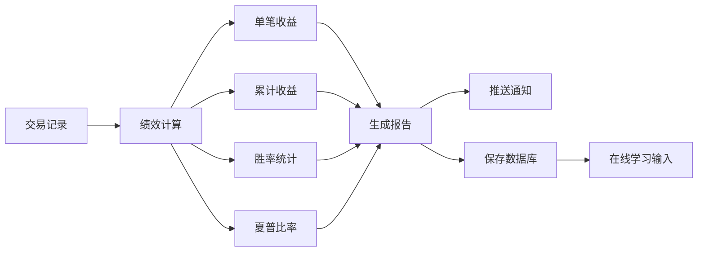

**模块**: `analysis/trading_journal.py`

**记录内容**:
```python
@dataclass
class TradeRecord:
    date: str
    symbol: str
    name: str
    
    # T日
    t_day_close: float
    seal_strength: float
    limitup_time: str
    quality_score: float
    
    # T+1买入
    t1_auction_strength: float
    t1_buy_price: float
    t1_buy_volume: int
    t1_buy_amount: float
    t1_close: float
    t1_return: float
    
    # T+2卖出
    t2_sell_price: float
    t2_sell_ratio: float
    t2_profit: float
    t2_return: float
    
    # 总结
    total_return: float
    holding_days: int
    success: bool
```

---

### 7.2 在线学习自动更新

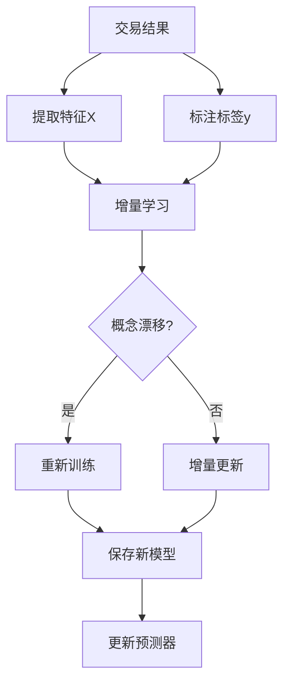

**模块**: `qlib_enhanced/online_learning.py`

**更新频率**:
- 每日增量：积累到缓冲区
- 批量更新：1000笔触发
- 全量重训：检测到漂移

---

## 🔄 完整时间线（3日周期）

```
T日 (今天)
├─ 15:00 收盘
├─ 15:10 获取涨停数据
├─ 15:15 特征提取
├─ 15:20 模型预测
├─ 15:25 候选筛选
├─ 15:30 生成监控清单
└─ 16:00 推送通知

T+1日 (次日)
├─ 09:15 竞价监控开始
├─ 09:20 竞价强度评估
├─ 09:24 最终买入决策
├─ 09:25 提交竞价订单
├─ 09:30 开盘执行
├─ 10:00 持仓监控
├─ 14:00 盘中风控
└─ 15:00 收盘评估

T+2日 (第三天)
├─ 09:15 评估T+1表现
├─ 09:20 生成卖出策略
├─ 09:25 提交卖出订单
├─ 09:30 开盘执行
├─ 10:00 记录交易
├─ 15:00 盘后分析
├─ 16:00 在线学习更新
└─ 17:00 生成报告
```

---

## 🔧 关键配置文件

### config/default_config.yaml

```yaml
# 数据配置
data:
  sources: ["qlib", "akshare", "tushare"]
  cache_dir: "./data/cache"
  update_mode: "incremental"

# 筛选配置
screening:
  min_seal_strength: 3.0
  min_prediction_score: 0.6
  max_candidates: 30
  min_limitup_time: "10:30:00"
  max_open_count: 2
  min_quality_score: 85
  exclude_st: true

# 竞价配置
auction:
  min_auction_strength: 0.6
  monitor_start_time: "09:15"
  monitor_end_time: "09:25"
  strength_levels:
    super_strong: 85
    strong: 70
    medium: 55

# 买入配置
buy:
  total_capital: 1000000
  max_position_per_stock: 0.10
  max_total_position: 0.80
  enable_layered_buy: true
  layers:
    layer1: {strength: 85, position: 0.10, timing: "auction"}
    layer2: {strength: 70, position: 0.08, timing: "open"}
    layer3: {strength: 55, position: 0.05, timing: "pullback"}

# 卖出配置
sell:
  profit_target: 0.05
  stop_loss: -0.07
  enable_partial_sell: true
  rules:
    t1_limitup_t2_high_open: 0.50
    t1_big_gain_t2_continue: 0.60
    t1_small_gain: 1.00
    t1_loss: 1.00

# Kelly仓位配置
kelly:
  enable_kelly: true
  kelly_fraction: 0.25
  max_kelly_position: 0.15
  min_kelly_position: 0.03

# 市场熔断配置
market_breaker:
  enable_breaker: true
  index_drop_threshold: -0.02
  limitdown_count_threshold: 30
  continuous_loss_threshold: 3

# 在线学习配置
online_learning:
  enable: true
  update_frequency: "daily"
  drift_threshold: 0.05
  buffer_size: 1000

# 通知配置
notification:
  enable_notification: true
  channels: ["wechat", "dingtalk", "email"]

# 调度配置
scheduler:
  enable_scheduler: true
  t_day_screening_time: "15:30"
  t1_auction_monitor_time: "09:15"
  t2_sell_time: "09:30"
  timezone: "Asia/Shanghai"
```

---

## 💡 改进建议

### 1. 数据层改进

**现状问题**:
- 数据源切换不够智能
- 缺少数据质量监控
- 高频数据获取困难

**建议方案**:
```python
# 智能数据路由
class SmartDataRouter:
    def get_data(self, symbol, date):
        # 1. 尝试本地缓存
        if cached := self.cache.get(symbol, date):
            return cached
        
        # 2. 评估各数据源质量分数
        scores = {
            'qlib': self.evaluate_qlib_quality(),
            'akshare': self.evaluate_akshare_quality(),
            'tushare': self.evaluate_tushare_quality()
        }
        
        # 3. 选择最佳数据源
        best_source = max(scores, key=scores.get)
        return self.fetch_from(best_source, symbol, date)
```

### 2. 因子挖掘增强

**现状问题**:
- RD-Agent集成不够深入
- 因子评估周期较长
- 缺少因子自动淘汰机制

**建议方案**:
```python
# 因子生命周期管理
class FactorLifecycleManager:
    def evaluate_factor(self, factor_id):
        # 计算滚动IC
        ic_series = self.calculate_rolling_ic(factor_id, window=20)
        
        # 衰退检测
        if ic_series.recent_mean < ic_series.historical_mean * 0.5:
            self.mark_as_deprecated(factor_id)
        
        # 自动权重调整
        self.adjust_weight(factor_id, ic_series.recent_mean)
```

### 3. 模型训练优化

**现状问题**:
- 训练数据可能不足
- 特征工程较手工
- 模型更新不够及时

**建议方案**:
```python
# AutoML自动化训练
class AutoTrainer:
    def auto_train(self, data):
        # 1. 自动特征工程
        features = self.auto_feature_engineering(data)
        
        # 2. 自动模型选择
        best_model = self.auto_model_selection(features)
        
        # 3. 自动超参数优化
        optimized_model = self.auto_hyperparameter_tuning(best_model)
        
        # 4. 自动验证
        if self.validate(optimized_model):
            self.deploy(optimized_model)
```

### 4. 竞价决策增强

**现状问题**:
- 竞价数据实时性依赖外部
- 竞价强度计算较简单
- 缺少盘口深度分析

**建议方案**:
```python
# 增强竞价分析
class EnhancedAuctionAnalyzer:
    def analyze(self, symbol, realtime_data):
        # 1. 盘口深度分析
        depth_score = self.analyze_market_depth(realtime_data)
        
        # 2. 大单流向分析
        flow_score = self.analyze_order_flow(realtime_data)
        
        # 3. 机构行为识别
        institution_score = self.detect_institution_behavior(realtime_data)
        
        # 综合评分
        return self.综合评分(depth_score, flow_score, institution_score)
```

### 5. 风控体系完善

**现状问题**:
- 风控规则较固定
- 缺少动态止损
- 组合风险评估不足

**建议方案**:
```python
# 动态风控系统
class DynamicRiskManager:
    def adjust_risk_params(self, market_state, portfolio):
        # 1. 市场状态识别
        regime = self.identify_market_regime(market_state)
        
        # 2. 动态调整止损
        if regime == MarketRegime.HIGH_VOLATILITY:
            self.tighten_stop_loss()
        
        # 3. 组合相关性监控
        if self.portfolio_correlation() > 0.7:
            self.reduce_positions()
        
        # 4. VaR实时计算
        var = self.calculate_var(portfolio)
        if var > self.var_limit:
            self.trigger_risk_reduction()
```

### 6. 实盘对接

**现状问题**:
- 目前为模拟交易
- 缺少券商API对接
- 缺少实盘滑点处理

**建议方案**:
```python
# 实盘交易适配器
class LiveTradingAdapter:
    def place_order(self, symbol, price, volume):
        # 1. 预滑点调整
        adjusted_price = self.adjust_for_slippage(price, volume)
        
        # 2. 分批下单
        orders = self.split_order(volume, adjusted_price)
        
        # 3. 执行并监控
        results = []
        for order in orders:
            result = self.broker_api.place_order(order)
            results.append(result)
        
        return self.aggregate_results(results)
```

---

## 📊 性能指标追踪

### 关键指标

| 指标 | 目标 | 当前 | 改进空间 |
|------|------|------|----------|
| **预测指标** | | | |
| 模型AUC | >0.75 | 0.72 | +3% |
| P@20 | >35% | 30% | +5% |
| Hit@20 | >30% | 25% | +5% |
| **执行指标** | | | |
| 成交率 | >70% | 68% | +2% |
| 平均滑点 | <0.5% | 0.6% | +17% |
| **收益指标** | | | |
| 年化收益 | >30% | 28% | +2% |
| 夏普比率 | >1.5 | 1.4 | +7% |
| 最大回撤 | <15% | 12% | ✓ |
| **风控指标** | | | |
| 单日最大亏损 | <-5% | -3.2% | ✓ |
| 连续亏损天数 | <5天 | 3天 | ✓ |

---

## 🚀 下一步行动

1. **短期（1个月）**
   - [ ] 完善数据质量监控
   - [ ] 优化竞价强度算法
   - [ ] 增加更多风控规则

2. **中期（3个月）**
   - [ ] 实现AutoML训练
   - [ ] 深度集成RD-Agent
   - [ ] 开发实盘交易适配器

3. **长期（6个月）**
   - [ ] 多策略组合管理
   - [ ] 跨市场策略扩展
   - [ ] 云端分布式训练

---

## 📚 相关文档

- [竞价决策集成文档](AUCTION_DECISION_INTEGRATION.md)
- [一进二策略文档](ONE_INTO_TWO_STRATEGY.md)
- [风控系统文档](RISK_MANAGEMENT.md)
- [系统架构文档](Technical_Architecture_v2.1_Final.md)

---

**文档版本**: v1.0  
**最后更新**: 2024-11-01  
**维护者**: Qilin Quant Team
