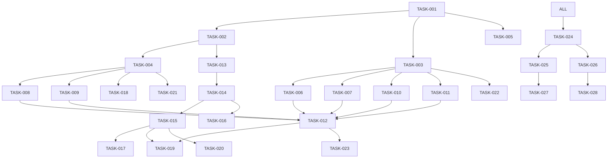

# TaskMaster-AI 任务拆解文档
## 麒麟量化系统 v1.2 开发任务

### 项目配置
```yaml
project_name: "Qilin Stack v1.2"
project_root: "D:\\test\\Qlib\\qilin_stack_with_ta"
team_size: 7
duration_weeks: 10
priority: "HIGH"
```

---

## PHASE 1: 基础架构搭建 [Week 1-2]

### TASK-001: 项目初始化与环境配置
**优先级**: P0
**预计工时**: 8h
**负责人**: DevOps工程师
**依赖**: 无
```
描述: 初始化项目结构，配置开发环境
子任务:
  1. 创建项目目录结构
  2. 配置Python虚拟环境
  3. 安装基础依赖包
  4. 设置Git仓库和分支策略
  5. 配置CI/CD pipeline
验收标准:
  - 项目结构清晰，符合规范
  - requirements.txt完整
  - Git workflow正常运行
```

### TASK-002: Qlib框架集成
**优先级**: P0
**预计工时**: 16h
**负责人**: 数据工程师
**依赖**: TASK-001
```
描述: 集成Qlib量化框架，配置数据源
子任务:
  1. 安装Qlib及依赖
  2. 下载CN股票数据
  3. 配置数据路径
  4. 验证数据完整性
  5. 编写数据访问接口
验收标准:
  - Qlib正常初始化
  - 能成功读取股票数据
  - 数据接口测试通过
```

### TASK-003: Multi-Agent基础框架
**优先级**: P0
**预计工时**: 24h
**负责人**: 架构师
**依赖**: TASK-001
```
描述: 搭建多Agent协作基础框架
子任务:
  1. 设计Agent基类
  2. 实现Agent注册机制
  3. 建立消息通信机制
  4. 实现Agent协调器
  5. 编写框架测试用例
验收标准:
  - Agent能正常创建和注册
  - 消息传递正常
  - 协调器能调度Agent
```

### TASK-004: 数据适配器开发
**优先级**: P0
**预计工时**: 16h
**负责人**: 后端开发
**依赖**: TASK-002
```
描述: 开发AkShare和TuShare数据适配器
子任务:
  1. 实现DataAdapter基类
  2. 开发AkShareAdapter
  3. 开发TuShareAdapter
  4. 实现数据标准化
  5. 编写适配器测试
验收标准:
  - 能获取实时行情数据
  - 能获取历史数据
  - 数据格式统一
```

### TASK-005: 测试框架搭建
**优先级**: P1
**预计工时**: 8h
**负责人**: 测试工程师
**依赖**: TASK-001
```
描述: 搭建自动化测试框架
子任务:
  1. 配置pytest环境
  2. 设置测试目录结构
  3. 编写测试基类
  4. 配置代码覆盖率工具
  5. 集成到CI/CD
验收标准:
  - 测试框架能正常运行
  - 覆盖率报告生成
  - CI/CD集成成功
```

---

## PHASE 2: 核心功能开发 [Week 3-5]

### TASK-006: 涨停质量分析Agent
**优先级**: P0
**预计工时**: 24h
**负责人**: 算法工程师A
**依赖**: TASK-003
```
描述: 实现涨停质量分析Agent
子任务:
  1. 分析涨停板特征
  2. 实现封单强度计算
  3. 计算涨停时间分布
  4. 评估涨停质量评分
  5. 编写单元测试
验收标准:
  - 正确识别涨停股票
  - 质量评分合理
  - 测试覆盖率>80%
```

### TASK-007: 龙头识别Agent
**优先级**: P0
**预计工时**: 24h
**负责人**: 算法工程师B
**依赖**: TASK-003
```
描述: 实现板块龙头识别Agent
子任务:
  1. 板块分类识别
  2. 计算板块内排名
  3. 评估龙头特征
  4. 生成龙头评分
  5. 编写测试用例
验收标准:
  - 准确识别板块龙头
  - 排名算法合理
  - 测试通过
```

### TASK-008: 龙虎榜分析Agent
**优先级**: P0
**预计工时**: 16h
**负责人**: 数据分析师A
**依赖**: TASK-004
```
描述: 实现龙虎榜数据分析Agent
子任务:
  1. 获取龙虎榜数据
  2. 解析营业部信息
  3. 识别游资和机构
  4. 计算买卖力量
  5. 生成分析报告
验收标准:
  - 龙虎榜数据完整
  - 正确识别主力类型
  - 分析逻辑正确
```

### TASK-009: 资金流向Agent
**优先级**: P0
**预计工时**: 16h
**负责人**: 数据分析师B
**依赖**: TASK-004
```
描述: 实现资金流向分析Agent
子任务:
  1. 计算资金流入流出
  2. 分析主力资金动向
  3. 识别资金性质
  4. 评估资金强度
  5. 生成资金报告
验收标准:
  - 资金计算准确
  - 能识别主力行为
  - 报告清晰明了
```

### TASK-010: 风控管理Agent
**优先级**: P0
**预计工时**: 24h
**负责人**: 风控专员
**依赖**: TASK-003
```
描述: 实现动态风控管理Agent
子任务:
  1. 设计风控规则
  2. 实现仓位控制
  3. 计算风险指标
  4. 动态调整限额
  5. 实现风控告警
验收标准:
  - 风控规则完整
  - 能有效控制风险
  - 告警及时准确
```

### TASK-011: 其他5个Agent实现
**优先级**: P1
**预计工时**: 40h
**负责人**: 开发团队
**依赖**: TASK-003
```
描述: 实现剩余5个分析Agent
子任务:
  1. 新闻情绪Agent
  2. 筹码分析Agent
  3. 缠论技术Agent
  4. 波浪理论Agent
  5. 斐波那契Agent
验收标准:
  - 每个Agent基础功能完成
  - 能输出有效分析结果
  - 测试用例通过
```

### TASK-012: Agent融合器开发
**优先级**: P0
**预计工时**: 16h
**负责人**: 架构师
**依赖**: TASK-006 to TASK-011
```
描述: 开发多Agent结果融合器
子任务:
  1. 设计融合算法
  2. 实现权重分配
  3. 计算综合评分
  4. 生成归因分析
  5. 优化融合性能
验收标准:
  - 融合算法合理
  - 权重可配置
  - 归因分析准确
```

---

## PHASE 3: Qlib集成优化 [Week 5-6]

### TASK-013: Alpha因子库集成
**优先级**: P0
**预计工时**: 16h
**负责人**: 量化研究员
**依赖**: TASK-002
```
描述: 集成Qlib Alpha因子库
子任务:
  1. 配置Alpha158因子
  2. 配置Alpha191因子
  3. 实现自定义因子
  4. 因子有效性验证
  5. 因子性能优化
验收标准:
  - 因子计算正确
  - 性能满足要求
  - IC/IR指标合格
```

### TASK-014: 模型训练Pipeline
**优先级**: P0
**预计工时**: 24h
**负责人**: ML工程师
**依赖**: TASK-013
```
描述: 实现模型训练流水线
子任务:
  1. 数据预处理
  2. 特征工程
  3. LightGBM训练
  4. 模型验证
  5. 超参数优化
验收标准:
  - Pipeline完整可用
  - 模型性能达标
  - 训练稳定可靠
```

### TASK-015: 在线预测系统
**优先级**: P0
**预计工时**: 16h
**负责人**: 后端开发
**依赖**: TASK-014
```
描述: 实现在线预测系统
子任务:
  1. 模型加载机制
  2. 实时特征计算
  3. 批量预测接口
  4. 预测结果缓存
  5. 性能优化
验收标准:
  - 预测延迟<100ms
  - 支持批量预测
  - 结果准确可靠
```

### TASK-016: Model Registry实现
**优先级**: P1
**预计工时**: 8h
**负责人**: DevOps
**依赖**: TASK-014
```
描述: 实现模型注册表
子任务:
  1. 设计注册表结构
  2. 实现模型版本管理
  3. 模型元数据存储
  4. 模型部署接口
  5. 回滚机制
验收标准:
  - 版本管理完善
  - 部署流程顺畅
  - 支持快速回滚
```

### TASK-017: 回测框架搭建
**优先级**: P0
**预计工时**: 24h
**负责人**: 量化研究员
**依赖**: TASK-015
```
描述: 搭建完整回测框架
子任务:
  1. 回测引擎开发
  2. 滑点模型实现
  3. 手续费计算
  4. 性能指标计算
  5. 回测报告生成
验收标准:
  - 回测结果准确
  - 指标计算完整
  - 报告清晰详细
```

---

## PHASE 4: 生产级增强 [Week 7-8]

### TASK-018: 安全签名机制
**优先级**: P0
**预计工时**: 16h
**负责人**: 安全工程师
**依赖**: TASK-004
```
描述: 实现下单安全签名机制
子任务:
  1. 设计签名算法
  2. 实现HMAC签名
  3. 时间戳验证
  4. 防重放攻击
  5. 签名验证接口
验收标准:
  - 签名算法安全
  - 验证机制完善
  - 无安全漏洞
```

### TASK-019: 降级预案实现
**优先级**: P0
**预计工时**: 16h
**负责人**: 架构师
**依赖**: TASK-012, TASK-015
```
描述: 实现系统降级预案
子任务:
  1. 设计降级策略
  2. 实现三级降级
  3. 自动切换机制
  4. 降级监控
  5. 恢复机制
验收标准:
  - 降级平滑
  - 自动触发
  - 快速恢复
```

### TASK-020: 压力测试实施
**优先级**: P0
**预计工时**: 8h
**负责人**: 测试工程师
**依赖**: TASK-015
```
描述: 执行系统压力测试
子任务:
  1. 编写压测脚本
  2. 10倍负载测试
  3. 性能瓶颈分析
  4. 优化建议
  5. 测试报告
验收标准:
  - 满足45秒SLA
  - 无内存泄漏
  - 系统稳定
```

### TASK-021: 数据一致性校验
**优先级**: P0
**预计工时**: 16h
**负责人**: 数据工程师
**依赖**: TASK-004
```
描述: 实现数据一致性校验机制
子任务:
  1. 设计校验规则
  2. 价格一致性检查
  3. 时间戳对齐
  4. 复权因子验证
  5. 自动告警
验收标准:
  - 校验规则完整
  - 自动化运行
  - 告警及时
```

### TASK-022: 监控告警系统
**优先级**: P0
**预计工时**: 24h
**负责人**: DevOps
**依赖**: TASK-003
```
描述: 搭建监控告警系统
子任务:
  1. Prometheus配置
  2. Grafana看板
  3. 告警规则设置
  4. 日志收集
  5. 性能监控
验收标准:
  - 监控全面
  - 告警准确
  - 可视化清晰
```

### TASK-023: Agent贡献度分析
**优先级**: P1
**预计工时**: 16h
**负责人**: 数据分析师
**依赖**: TASK-012
```
描述: 实现Agent贡献度归因分析
子任务:
  1. 设计归因算法
  2. 计算贡献度
  3. 可视化展示
  4. 历史分析
  5. 优化建议
验收标准:
  - 归因准确
  - 可解释性强
  - 指导优化
```

---

## PHASE 5: 系统集成测试 [Week 9-10]

### TASK-024: 端到端集成测试
**优先级**: P0
**预计工时**: 24h
**负责人**: 测试团队
**依赖**: All previous tasks
```
描述: 执行全系统集成测试
子任务:
  1. 测试用例设计
  2. 功能测试
  3. 性能测试
  4. 安全测试
  5. 回归测试
验收标准:
  - 功能完整
  - 性能达标
  - 无重大缺陷
```

### TASK-025: 性能优化
**优先级**: P0
**预计工时**: 16h
**负责人**: 架构师
**依赖**: TASK-024
```
描述: 系统性能优化
子任务:
  1. 性能分析
  2. 瓶颈定位
  3. 代码优化
  4. 缓存优化
  5. 数据库优化
验收标准:
  - 响应时间达标
  - 资源占用合理
  - 系统稳定
```

### TASK-026: 文档完善
**优先级**: P0
**预计工时**: 16h
**负责人**: 技术文档工程师
**依赖**: TASK-024
```
描述: 完善项目文档
子任务:
  1. API文档
  2. 部署文档
  3. 用户手册
  4. 开发文档
  5. FAQ文档
验收标准:
  - 文档完整
  - 示例清晰
  - 易于理解
```

### TASK-027: 部署脚本开发
**优先级**: P0
**预计工时**: 8h
**负责人**: DevOps
**依赖**: TASK-025
```
描述: 开发自动化部署脚本
子任务:
  1. Docker镜像构建
  2. K8s部署配置
  3. 环境变量管理
  4. 健康检查
  5. 回滚脚本
验收标准:
  - 一键部署
  - 配置灵活
  - 回滚可靠
```

### TASK-028: UAT验收测试
**优先级**: P0
**预计工时**: 16h
**负责人**: 产品团队
**依赖**: TASK-026
```
描述: 用户验收测试
子任务:
  1. 业务场景测试
  2. 用户体验评估
  3. 功能验收
  4. 性能验收
  5. 签字确认
验收标准:
  - 业务需求满足
  - 用户体验良好
  - 正式验收通过
```

---

## 任务依赖关系图



---

## 风险与缓解措施

### 高风险任务
1. **TASK-014 模型训练**: 模型性能不达标
   - 缓解：准备多个备选模型，增加调优时间

2. **TASK-019 降级预案**: 降级机制失效
   - 缓解：充分测试，多级降级策略

3. **TASK-020 压力测试**: 性能不满足SLA
   - 缓解：预留优化时间，准备扩容方案

### 关键路径
```
TASK-001 → TASK-003 → TASK-006/007 → TASK-012 → TASK-019 → TASK-024
```
此路径上的任务延期将直接影响项目交付。

---

## 资源分配

### 人员安排
| 角色 | 负责任务数 | 关键任务 |
|------|-----------|----------|
| 架构师 | 4 | TASK-003, TASK-012, TASK-019, TASK-025 |
| DevOps | 4 | TASK-001, TASK-016, TASK-022, TASK-027 |
| 算法工程师 | 2 | TASK-006, TASK-007 |
| ML工程师 | 1 | TASK-014 |
| 数据工程师 | 3 | TASK-002, TASK-004, TASK-021 |
| 测试工程师 | 3 | TASK-005, TASK-020, TASK-024 |
| 量化研究员 | 2 | TASK-013, TASK-017 |

### 关键时间节点
- Week 2: 基础架构完成
- Week 5: 核心功能完成
- Week 6: Qlib集成完成
- Week 8: 生产级功能完成
- Week 10: 项目交付

---

## 验收标准总结

### 功能验收
- [ ] 10个Agent全部实现并测试通过
- [ ] Qlib集成完成，模型预测正常
- [ ] 双时间窗口工作正常
- [ ] 安全机制完整可靠

### 性能验收
- [ ] 全流程时延 < 45秒
- [ ] 10倍负载压力测试通过
- [ ] 系统可用性 > 99%

### 文档验收
- [ ] 技术文档完整
- [ ] 用户手册清晰
- [ ] 部署文档可用

---

*TaskMaster文档版本：1.0*
*生成时间：2024-10-15*
*项目经理：[待指定]*
*总任务数：28*
*预计总工时：464小时*