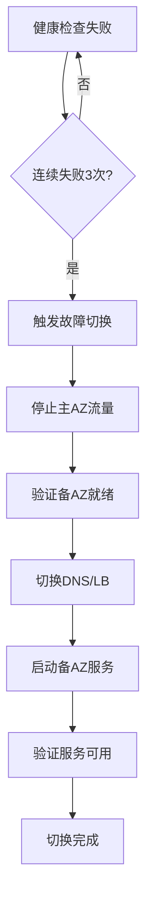

# 麒麟量化系统跨AZ容灾架构设计

**版本**: 1.0  
**更新日期**: 2025-10-16  
**任务编号**: P0-15

---

## 1. 架构概述

### 1.1 设计目标
- **RTO** (Recovery Time Objective): ≤ 5分钟
- **RPO** (Recovery Point Objective): ≤ 1分钟
- **可用性**: 99.99% (四个9)
- **数据一致性**: 最终一致性，关键业务强一致性

### 1.2 部署架构
```
┌─────────────────────────────────────────────────────────┐
│                     Global Load Balancer                 │
│                    (DNS + Health Check)                  │
└──────────────┬─────────────────────┬────────────────────┘
               │                     │
    ┌──────────▼──────────┐ ┌───────▼──────────┐
    │    Primary AZ (A)   │ │  Secondary AZ (B) │
    │   (Active-Active)   │ │  (Active-Standby) │
    └─────────────────────┘ └──────────────────┘
               │                     │
    ┌──────────▼──────────────────────▼──────────┐
    │         Cross-AZ Data Replication           │
    │    (PostgreSQL, Redis, Kafka, MinIO)       │
    └─────────────────────────────────────────────┘
```

---

## 2. 容灾模式

### 2.1 Active-Active模式（推荐）
**适用场景**: 实时交易、高并发场景

**特点**:
- 两个AZ同时提供服务
- 负载均衡分配流量
- 实时数据同步
- 任一AZ故障不影响服务

### 2.2 Active-Standby模式
**适用场景**: 批处理、非实时场景

**特点**:
- 主AZ提供服务
- 备AZ热备份
- 异步数据同步
- 故障时切换到备AZ

---

## 3. 数据同步策略

### 3.1 PostgreSQL
```yaml
同步方式: 流复制 + 逻辑复制
复制模式: 异步复制（RPO≤30s）
切换策略: 
  - 自动故障切换（Patroni）
  - 读写分离
  - 连接池故障转移
```

### 3.2 Redis
```yaml
同步方式: Redis Sentinel + Redis Cluster
复制模式: 异步复制
切换策略:
  - Sentinel自动故障切换
  - 客户端智能路由
  - 缓存预热机制
```

### 3.3 Kafka
```yaml
同步方式: Mirror Maker 2.0
复制模式: 异步复制
切换策略:
  - 多副本跨AZ分布
  - ISR机制保证数据不丢失
  - Consumer Group自动重平衡
```

### 3.4 MinIO/S3
```yaml
同步方式: 跨区域复制
复制模式: 异步复制
切换策略:
  - 多区域Bucket
  - 客户端多路径访问
  - 最终一致性保证
```

---

## 4. 故障切换流程

### 4.1 自动切换


### 4.2 手动切换
1. **准备阶段**
   - 通知相关人员
   - 检查备AZ状态
   - 准备回滚方案

2. **执行阶段**
   - 停止写入操作
   - 等待数据同步完成
   - 切换流量到备AZ
   - 验证服务正常

3. **验证阶段**
   - 业务功能验证
   - 性能指标验证
   - 数据一致性验证

---

## 5. 健康检查机制

### 5.1 应用层健康检查
```python
健康检查端点:
  - /health: 基础健康检查
  - /ready: 就绪检查
  - /health/dependencies: 依赖检查

检查项目:
  - API响应时间
  - 数据库连接
  - 缓存可用性
  - 消息队列状态
```

### 5.2 基础设施健康检查
```yaml
K8s探针:
  livenessProbe:
    httpGet:
      path: /health
      port: 8000
    initialDelaySeconds: 30
    periodSeconds: 10
    
  readinessProbe:
    httpGet:
      path: /ready
      port: 8000
    initialDelaySeconds: 10
    periodSeconds: 5
```

---

## 6. 流量切换策略

### 6.1 DNS切换
```yaml
方式: Route53/CloudFlare
TTL: 60秒
健康检查: 每30秒
切换时间: 1-2分钟
```

### 6.2 负载均衡器切换
```yaml
方式: ALB/NLB/Nginx
健康检查: 每5秒
切换时间: 10-30秒
流量分配: 加权轮询
```

### 6.3 渐进式切换
```python
切换步骤:
  1. 10% 流量切换到备AZ
  2. 监控5分钟，验证正常
  3. 30% 流量切换
  4. 监控5分钟
  5. 50% 流量切换
  6. 监控5分钟
  7. 100% 流量切换
```

---

## 7. 监控告警

### 7.1 关键指标
```yaml
AZ健康度:
  - API可用性
  - 响应时间P95
  - 错误率

数据同步:
  - 复制延迟
  - 同步队列深度
  - 数据差异率

切换指标:
  - 切换次数
  - 切换耗时
  - 切换成功率
```

### 7.2 告警规则
```yaml
严重告警:
  - 主AZ完全不可用
  - 数据同步中断>5分钟
  - 切换失败

警告告警:
  - 复制延迟>1分钟
  - AZ间网络延迟>100ms
  - 备AZ容量不足
```

---

## 8. 容灾演练计划

### 8.1 演练场景
1. **网络分区**: 模拟AZ间网络中断
2. **主库故障**: 模拟PostgreSQL主库宕机
3. **完整AZ故障**: 模拟整个AZ不可用
4. **部分服务故障**: 模拟特定服务故障
5. **数据损坏**: 模拟数据一致性问题

### 8.2 演练频率
- **月度演练**: 部分服务切换
- **季度演练**: 完整AZ切换
- **年度演练**: 大规模故障模拟

### 8.3 验收标准
```yaml
RTO实测: ≤5分钟
RPO实测: ≤1分钟
数据一致性: 100%
服务可用性: ≥99.9%
告警及时性: ≤30秒
```

---

## 9. 回滚方案

### 9.1 快速回滚
```bash
# 1. 停止备AZ流量
kubectl scale deployment --replicas=0 -n qilin-system

# 2. 切换回主AZ
./scripts/dr/switch_to_primary.sh

# 3. 验证主AZ服务
./scripts/dr/verify_primary.sh
```

### 9.2 数据回滚
```sql
-- PostgreSQL时间点恢复
SELECT pg_create_restore_point('before_failover');
-- 恢复到故障前
PITR recovery_target_name = 'before_failover';
```

---

## 10. 最佳实践

### 10.1 设计原则
1. ✅ **简单优先**: 避免过度复杂的切换逻辑
2. ✅ **自动化**: 减少人工操作
3. ✅ **可观测性**: 充分的监控和日志
4. ✅ **定期演练**: 验证方案有效性
5. ✅ **文档完整**: 详细的操作手册

### 10.2 注意事项
1. ⚠️ 避免脑裂问题
2. ⚠️ 确保数据一致性
3. ⚠️ 控制切换成本
4. ⚠️ 防止级联故障
5. ⚠️ 保持配置同步

---

## 11. 成本优化

### 11.1 资源配置
```yaml
主AZ:
  - 100%容量
  - 生产级配置
  - 预留扩容空间

备AZ:
  - 50-70%容量（平时）
  - 自动扩容能力
  - 成本优化实例
```

### 11.2 数据传输
- 使用专线降低带宽成本
- 压缩传输数据
- 增量同步减少流量

---

## 12. 合规要求

### 12.1 监管合规
- ✅ 金融行业两地三中心要求
- ✅ 等保2.0容灾备份要求
- ✅ 数据本地化存储

### 12.2 审计要求
- 所有切换操作记录
- 数据同步审计日志
- 定期容灾报告

---

## 附录A: 切换检查清单

### 切换前检查
- [ ] 备AZ资源充足
- [ ] 数据同步正常
- [ ] 网络连通性正常
- [ ] 依赖服务就绪
- [ ] 团队成员就位

### 切换后验证
- [ ] 服务可访问
- [ ] 业务功能正常
- [ ] 数据一致性
- [ ] 性能指标正常
- [ ] 监控告警正常

---

## 附录B: 联系人列表

| 角色 | 姓名 | 电话 | 职责 |
|------|------|------|------|
| 总指挥 | - | - | 决策切换 |
| 技术负责人 | - | - | 执行切换 |
| DBA | - | - | 数据库切换 |
| 网络工程师 | - | - | 网络切换 |
| 业务负责人 | - | - | 业务验证 |

---

**文档维护**: Platform Team  
**更新频率**: 每季度  
**下次审核**: 2026-01-16